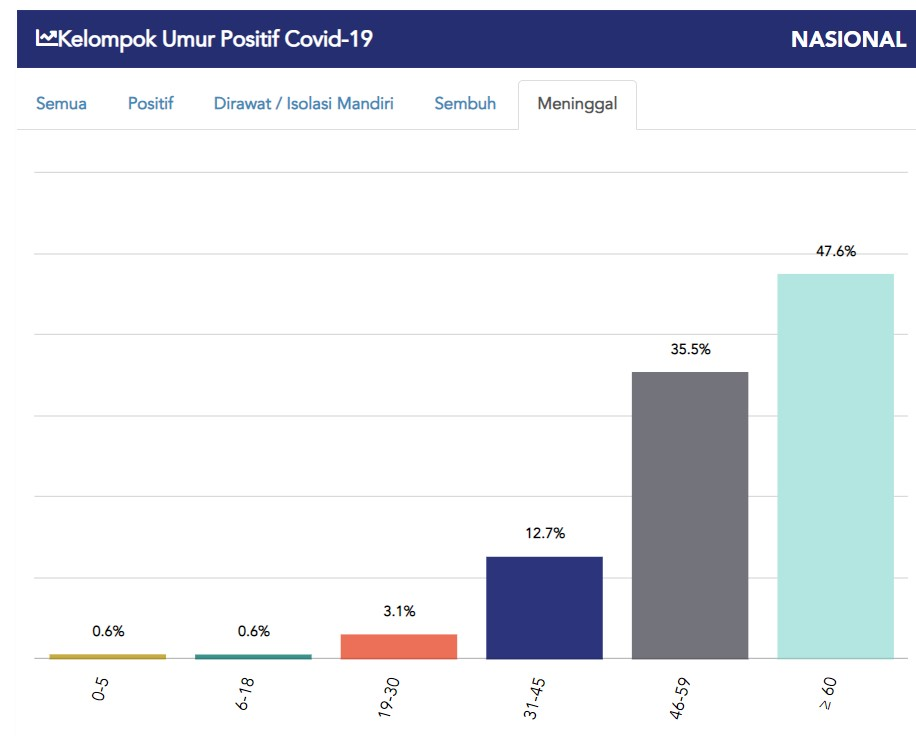
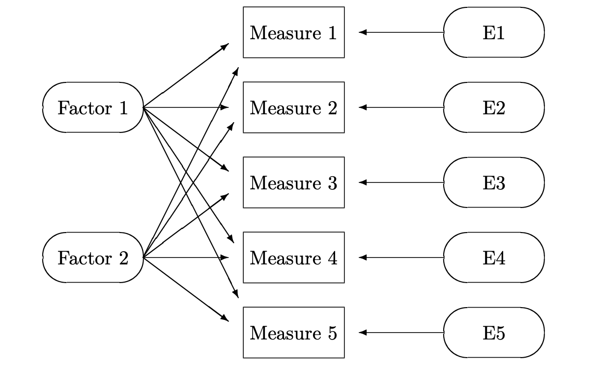

<style>
body {
text-align: justify
}
</style>
```{r setup, include=FALSE}
# clear-up the environment
rm(list = ls())

# chunk options
knitr::opts_chunk$set(
  message = FALSE,
  warning = FALSE,
  fig.align = "center",
  comment = "#>"
)

options(scipen = 999)
```

## Pendahuluan {.tabset}

### Latar Belakang

Setiap harinya, jumlah kasus positif COVID-19 di Indonesia terus mengalami peningkatan. Provinsi DKI Jakarta menjadi provinsi dengan jumlah kasus positif COVID-19 terbanyak di Indonesia. Meski disadari bahwa virus COVID-19 dapat menginfeksi siapa saja, tetapi beberapa kelompok orang memiliki tingkat risiko yang lebih tinggi untuk terpapar. Sebagai contoh, jika dilihat pada data kematian akibat COVID-19 per kelompok umur per tanggal 1 September 2022, penduduk rentan seperti usia lansia (≥ 60 tahun) menyumbang kematian sebesar 47,6% dari total kematian akibat COVID-19.

```{r, out.width = "30%", echo = FALSE, fig.align = "center"}

```

Selain itu, pada kasus positif COVID-19 dan sedang dirawat atau isolasi, proporsi penduduk berjenis kelamin perempuan lebih banyak dibandingkan laki-laki (Kemenkes, 2021). Tingkat kerentanan sosial masyarakat telah banyak dilakukan melalui indeks kerentanan sosial. **Kerentanan sosial wilayah menggambarkan kerapuhan sosial dari suatu wilayah akibat pengaruh dari adanya bahaya**. Faktor-faktor kerentanan sosial menjadi salah satu hal yang krusial di tengah pandemi COVID-19. Hal ini dikarenakan gabungan faktor kerentanan sosial tersebut dapat meningkatkan risiko terkena COVID-19.

### Tujuan

Untuk mengetahui kelompok yang memiliki resiko lebih tinggi (rentan) dan seberapa cepat pulih terhadap dampak COVID-19 menjadi penting, mengingat hal ini dapat meningkatkan kesadaran, mencegah terinfeksi COVID-19, dan menurunkan tingkat kematian. 

### Dataset
Sumber data yang digunakan untuk melakukan analisis ini bersumber dari:

- *Website Open* Data DKI Jakarta berupa variabel:
  + persentase penduduk perempuan,
  + persentase kepala keluarga berjenis kelamin perempuan, 
  + persentase penduduk lansia,
  + persentase pengangguran, 
  + persentase penduduk wajib KTP, 
  + jumlah daerah rawan banjir,
  + persentase pekerja di sektor informal, dan
  + jumlah puskesmas. 
  
- *Website Open* Data COVID-19 Provinsi DKI Jakarta berupa variabel:
  + jumlah kasus positif COVID-19, 
  + jumlah penduduk yang dirawat akibat COVID-19, dan 
  + jumlah penduduk yang melakukan isolasi mandiri akibat COVID-19.
  
- Publikasi Kabupaten/Kota dalam Angka oleh BPS untuk setiap kota dan kabupaten di Provinsi DKI Jakarta berupa variabel:
  + jumlah RS umum

## *Theoretical Concept*

### Multivariate Analysis
Multivariate analysis adalah sekelompok metode statistik yang berfokus pada mempelajari banyak variabel bersama-sama sambil berfokus pada variasi yang dimiliki oleh variabel-variabel tersebut.

> *Multivariate Statistics deals with the treatment of data sets with a large number of dimensions.*


### Analisis Faktor / *Factor Analysis*

```{r, out.width = "10%", echo = FALSE, fig.align = "center"}

```
Analisis faktor bertujuan untuk menerangkan struktur ragam-peragam melalui kombinasi linier dari variabel-variabel pembentuknya. Pada dasarnya, analisis faktor mendekatkan data pada suatu pengelompokkan berdasarkan adanya keeratan hubungan antar-dimensi pembentuk faktor. Statistik kunci yang relevan dengan analisis faktor antara lain

#### *Bartletts test of sphericity*

*Bartletts test of sphericity* yaitu suatu uji statistik yang dipergunakan untuk menguji hipotesis bahwa variabel tidak saling berkorelasi dalam populasi. Statistik uji Bartlett adalah sebagai berikut:

$$\chi^2= -[(N-1)-\frac{2p+5}{6}] ln|R|$$
dengan $N$ merupakan jumlah observasi, $p$ merupakan jumlah variabel, dan $|R|$ merupakan determianan matriks korelasi.

#### *Kaiser-Meyer-Olkin (KMO)*

KMO adalah uji yang dilakukan untuk menentukan kelayakan (appropriateness) dari suatu analisis faktor yang akan dilakukan. Skala uji KMO berkisar antara 0 sampai 1. Jika nilai KMO hitung lebih rendah dari 0.5, maka analisis faktor tidak layak dilakukan. Sedangkan jika nilai KMO hitung lebih besar dari 0.5, maka analisis faktor layak dilakukan. Statistik Uji Kaiser-Meyer-Olkin adalah sebagai berikut:

$$KMO = \frac {\sum\sum_{j≠k} r^2_{jk}}{\sum\sum_{j≠k}r^2_{jk} + \sum\sum_{j≠k}p^2_{jk}}$$
di mana:
- $r_{jk}$ = koefisien korelasi antara variabel ke-j dan ke-k
- $p_{jk}$ = koefisien korelasi parsial antara variabel ke-j dan ke-k

#### *Measure of Sampling Adequacy (MSA)*

*Measure of Sampling Adequacy* (MSA) yaitu suatu indeks perbandingan natara koefisien korelasi parsial untuk setiap variabel. MSA digunakan untuk mengukur kecukupan sampel. 

### *Principal Component Analysis* (PCA)
PCA merupakan suatu algoritma unsupervised learning yang bertujuan untuk *dimentionality reduction*. Salah satu tujuan dari PCA adalah untuk mengubah variabel asli yang saling berkorelasi satu sama lainnya menjadi satu set variabel baru yang memiliki korelasi lebih kecil atau saling bebas.

Ide dasar dari PCA adalah untuk membuat sumbu (axis) baru yang dapat menangkap informasi sebesar mungkin. Sumbu baru ini adalah yang dinamakan sebagai **Principal Component (PC)**. Untuk melakukan dimensionality reduction, kita akan memilih beberapa PC untuk dapat merangkum informasi yang dibutuhkan. Nilai masing-masing PC dibentuk dari matriks varian-kovarians dari suatu set variabel melalui kombinasi linear dari variabel-variabel tersebut.

$$ PC1 = a_{11}x_1 + a_{12}x_2 + ... + a_{1p}x_p $$
di mana:
- vektor **$a_1$** adalah eigen vector dari suatu matriks varian kovarians
- Nilai $x_i$ adalah nilai suatu data pada baris ke-i

Hal-hal yang menjadi pedoman dalam menentukan jumlah PC, yaitu:
1. Mempertahankan PC yang cukup untuk menjelaskan persentase yang spesifik dari total variansi/informasi
2. Mempertahankan PC yang memiliki eigen value lebih besar dibandingkan rata-rata eigen value dari setiap PC

## Load Packages

Berikut merupakan basic packages yang digunakan selama pengerjaan analisis:

```{r}
library(readr) # untuk membaca data
library(dplyr) # untuk data manipulation
library(GGally) # untuk membuat matriks korelasi
library(psych) # 
library(corrplot) #
library(ggplot2)
library (GPArotation)
library(factoextra) # for model comparison and assumption check)
library(gridExtra)
library(tidyr)
library(rmdformats)
library(BAMMtools)
```

## Data Loading
Pada project ini, dilakukan observasi pada level kecamatan dengan jumlah observasi sebanyak 44 kecamatan di Provinsi DKI Jakarta. Hal ini diakibatkan observasi level kecamatan memiliki data yang terbaru dan paling lengkap. Adapun variabel yang digunakan berasal dari berbagai sumber yang telah disebutkan di atas. Berikut adalah 12 variabel yang digunakan: 

```{r}
rentan <- readxl::read_xlsx("dataset/kerentanansosial.xlsx")
rmarkdown::paged_table(rentan)
```

Berikut adalah deskripsi data untuk `rentan`:

- `Kecamatan` = Nama kecamatan pada masing-masing kota administratif pada Provinsi DKI Jakarta
- `perempuan` = persentase penduduk perempuan
- `KK_perempuan` = persenyase kepala keluarga berjenis kelamin perempuan
- `lansia` = persentase penduduk lansia
- `pengangguran` = persentase pengangguran
- `wajib_ktp` = persentase penduduk wajib KTP
- `banjir` = jumlah daerah rawan banjir
- `informal` = persentase pekerja di sektor informal
- `RS` = jumlah RS umum
- `puskesmas` = jumlah puskesmas 
- `positif_cov` = jumlah kasus positif akibat COVID-19 (data 30 april 2021)
- `rawat` = jumlah penduduk yang dirawat akibat COVID-19
- `isoman` = jumlah penduduk yang melakukan isolasi mandiri akibat COVID-19 (data 30 april 2021)

## Data Wrangling

```{r}
glimpse(rentan)
```

## Exploratory Data Analysis
Sebelum dilakukannya analisis lebih lanjut, alangkah lebih baik kita mengeksplorasi data kerentanan sosial dalam bentuk visualisasi.

### 1. Melakukan pengecekan missing value
```{r}
colSums(is.na(rentan))
```

### 2. Gambaran umum variabel penyusun indeks kerentanan sosial

```{r}
summary(rentan)
```
```{r}
rentan[which(rentan$pengangguran < 0.1951 | rentan$pengangguran > 1.770), ]
```

Berdasarkan hasil `summary(rentan)`, secara umum terdapat 49,73 persen jumlah penduduk perempuan yang ditunjukan oleh rata-rata `perempuan` dengan 21,09 persen merupakan kepala keluarga yang berjenis kelamin perempuan dari variabel `KK_perempuan`. Sedangkan untuk rata-rata jumlah penduduk lansia di Jakarta sebesar 8,997 persen yang ditunjukan oleh `lansia`.

Kemudian untuk variabel `pengangguran`, secara rata-rata sebesar 0,5611 persen dengan nilai maksimum 1,77 persen berada di Kecamatan Kep. Seribu Selatan dan nilai terendah 0,195 berada di Kecamatan Kembangan. Perbedaan antara nilai maksimum dan minimum yang hampir 10 kali lipat ini menunjukkan belum meratanya tingkat pengangguran di DKI Jakarta. Selain itu, terdapat 12,412 persen pekerja informal di DKI Jakarta. 

Membahas lebih lanjut lagi mengenai variabel yang digunakan dalam penelitian ini, KTP merupakan salah satu dokumen administrasi yang sangat penting dan harus dimiliki seluruh masyarakat Indonesia. Tanpa adanya kepemilikan dokumen ini, maka akan terjadi kesulitan dalam menggunakan berbagai layanan publik, seperti kesehatan, perbankan, pendidikan, pendataan pemerintah, dan lain sebagainya. Namun, persentase penduduk wajib KTP di DKI Jakarta yang ditunjukkan oleh `wajib_KTP` secara umum hanya sebesar 72,78 persen, yang menandakan belum semua masyarakat sadar akan pentingnya kepemilikan KTP.

Dari hasil `summary()`, diketahui bahwa setiap variabel memiliki range nilai yang cukup berbeda, hal ini menyebabkan data yang dimiliki perlu untuk dilakukan scaling/standardisasi.

### Melihat visualisasi antar beberapa variabel

```{r}
ggpairs(rentan[,c(2:13)], showStrips = F, upper = list(continuous = wrap("cor", size=2))) + 
  theme(axis.text = element_text(colour = "black", size = 7),
        strip.background = element_rect(fill = "#6e8f71"),
        strip.text = element_text(colour = "white", size = 6,
                                  face = "bold"))
```

```{r, fig.height=5}
ggplot(data = rentan, mapping = aes(x=  lansia, y= reorder(Kecamatan,lansia))) +
  geom_col(aes(fill = lansia))  + # untuk membuat barplot 
  labs(
    title = "Persentase Jumlah Lansia pada masing-masing Kecamatan di Provinsi DKI Jakarta",
    x = "Persentase Lansia",
    y = "Kecamatan"
  ) +
  scale_fill_gradient(low = "#a9d1b1", high = "#4c614e") +
  geom_text(mapping = aes(label=round(lansia, digits = 4)), # menambahkan informasi label masing-masing kategori dengan variasi box
            col = "white", # memberikan warna pada text
            nudge_x = -1, # menggeser text berdasarkan sumbu x
            label.size = 12) + 
  theme_minimal() +
  theme(legend.position = "none") # untuk menghilangkan legend.
```


## Penyusun Kerentanan Sosial 
Pada bagian ini dilakukan tiga teknik analisis untuk melihat bagaimana kerentanan sosial yang diakibatkan COVID-19.
1. Digunakan metode *Factor Analysis*  untuk membentuk indeks kerentanan sosial per kecamatan di DKI Jakarta.
2. Kemudian melakukan pengklusteran menggunakan metode non-hierarchical clustering
3. Uji Kruskal-Wallis untuk mengetahui bagimana variabel mempengaruhi kerentanan sosial pada masing-masing klaster.

### Factor Analysis / Analisis Faktor
Sebelum dilakukan analisis faktor pada data kerentanan sosial, perlu dilakukan beberapa pengujian validitas untuk memutuskan apakah data yang dimiliki sudah memenuhi syarat untuk dianalisis menggunakan analisis faktor.

#### Melakukan uji multikolinearitas pada seluruh variabel. 
Tujuan dari membentuk plot korelasi adalah untuk menguji kolinearitas dari data. Seluruh variabel harus memiliki korelasi, tetapi tidak terlalu tinggi.

```{r}
ggcorr(rentan, label = T, hjust = 1, layout.exp = 2, size = 3, label_size = 2, label_round = 2, low = "#d7fc5b", mid = "white", high = "#5d8064")
```

Correlation plot di atas yang digunakan untuk menguji multikolinearitas dari data. Pada project ini, digunakan batas (>0,85) sebagai batas korelasi ekstrem terhadap setiap variabel. Dapat dilihat bahwa semua variabel tidak memiliki nilai korelasi yang lebih dari 0,85. 

#### *Kaiser–Meyer–Olkin* (KMO) - *Measure of Sampling Adequacy*(MSA)
Untuk dapat melakukan pengujian KMO dan MSA, pada R disediakan suatu function `KMO()` dari library `psych`. 

```{r}
rentan_cor <- cor(rentan[,2:13])
rentan_KMO<-KMO(rentan_cor)
```

Melakukan inspeksi nilai KMO
```{r}
rentan_KMO$MSA
```
Untuk nilai KMO didapatkan sebesar 0,7315378. Syarat dapat dilanjutkannya proses analisis faktor adalah nilai KMO lebih besar dari nilai 0,5. Dari hasil tersebut dapat dikatakan bahwa proses analisis faktor bisa dilanjutkan ke proses selanjutnya karena syarat dilanjutkannya proses analisis faktor terpenuhi.

Melakukan inspeksi nilai MSA masing-masing variabel
```{r}
rmarkdown::paged_table(as.data.frame(rentan_KMO$MSAi))
```
Dari hasil output nilai MSA masing-masing variabel di atas didapatkan seluruh nilai MSA dari setiap variabel (> 0,5). Sehingga bisa dinyatakan bahwa semua variabel dapat diprediksi dan dianalisis lebih lanjut

#### *The Bartlett’s Test statistics*
Bartlett’s test digunakan untuk mengkonfirmasi bahwa data berkorelasi secara berpasangan (Mickey & Sharma, 1997). Dengan kata lain uji bartlett digunakan untuk mengetahui homogenitas variance.

- Hipotesis uji
  + H0 = Varians di antara masing-masing variabel adalah sama (variance homogen)
  + H1 = Setidaknya satu variabel memiliki varians yang tidak sama dengan yang lain (variance tidak homogen)

- Pengujian yang diharapkan adalah data memiliki variance yang tidak homogen (tolak H0).

```{r}
bartlett.test(rentan[,2:13])
```

Hasil perhitungan dengan R dihasilkan nilai Bartlett test of homogeneity variances sebesar 5144 dengan signifikansi sebesar 0,000. Dengan demikian, Bartlett test of homogeneity of variances memenuhi persyaratan karena signifikansi di bawah 0,05 (5%), sehingga variance tidak homogen.

#### Membentuk faktor-faktor penyusun kerentanan sosial
Untuk melakukan exploratory factor analysis menggunakan MinRes (Minimum Residual), fungsi yang tersedia di R adalah `fa()` dari library `psych`. 

Parameter fungsi `fa()`
- `r`: Correlation/covariance matrix dari data awal

```{r}
fa_rentan <- fa(r = rentan_cor)
fa_rentan
```

Secara default, objek factor analysis yang terbentuk menghasilkan sejumlah 1 faktor. Jumlah ini dapat saja belum optimal, sehingga perlu untuk mencari jumlah faktor yang optimal dari data yang kita miliki.

Salah satu cara untuk mencari jumlah faktor yang optimal dari data, digunakan sebuah fungsi yaitu `fa.parallel()`. Metode ini mencari jumlah faktor optimal dari nilai eigen yang berurutan, kemudian penurunan tajam dalam plot menunjukkan jumlah komponen atau faktor yang sesuai untuk diekstraksi.

```{r}
nfactors <- fa.parallel(rentan[,2:13], plot = T)
summary(nfactors)
```
Dari hasil paralell analysis scree plot di atas dihasilkan `factors=2` sebagai jumlah faktor yang optimal pada data rentan.

Selanjutnya akan kembali dilakukan analisis faktor menggunakan jumlah faktor optimal yang sudah didapatkan.
Parameter tambahan fungsi `fa()`
- `nfactors`: banyaknya faktor yang akan dibentuk
- `rotate` : tipe rotasi. Rotasi meminimalkan kompleksitas faktor untuk membuat struktur lebih sederhana untuk ditafsirkan.
```{r}
# jumlah faktor optimal yang didapat
nfact <- nfactors$nfact

#factor analysis
fa_rentan_opt <- fa(r = rentan_cor, nfactors = nfact, rotate = "varimax")
fa_rentan_opt
```
Dari output di atas dengan menggunakan faktor sebanyak 2 didapatkan beberapa informasi sebagai berikut:

- 1. `SS Loadings`: Nilai Eigen.

- 2. `Proportion Var`: Memberitahu kita berapa banyak varians/informasi keseluruhan yang diperhitungkan faktor dari semua variabel.

- 3. `Cumulative Var`: Nilai akumulasi dari proportion var.

- 4. `Proportion Explained`: Jumlah variansi relatif yang terjelaskan. Merupakan pembagian dari proportion var/ sum(proportion var).

- 5. `Cumulative Proportion`: Jumlah akumulasi dari proportion explained.

- 6. `MR`: Minimum Residual/factor dapat disebut juga sebagai komponen utama.

- 7. `h2`: jumlah varians dalam item/variabel yang dijelaskan oleh faktor-faktor (yang dipertahankan). Ekuivalen dengan SS Loadings untuk variabel / communality

- 8. `u2`: merupakan nilai 1-`h2` adalah residual variance.

- 9. `com`: item complexity.

> Dengan menggunakan 2 faktor, maka informasi keseluruhan yang diperhitungkan faktor dari semua variabel sebanyak 0,59 atau 59%.

#### Faktor-Faktor Pembentuk Kerentanan Sosial di Provinsi DKI Jakarta
Salah satu tujuan dari factor analysis adalah melakukan ekstraksi dengan menghasilkan variabel laten. Variabel laten yang dihasilkan nantinya akan dijadikan sebagai faktor-faktor pembentuk kerentanan sosial pada data.

```{r}
fa.diagram(fa_rentan_opt, rsize = 1)
```

Arah dari masing-masing variabel ditentukan berdasarkan kajian literatur dari (Rufat et al., 2015), dimana arah tersebut ditentukan berdasarkan pengaruhnya terhadap kerentanan sosial. Arah positif berpengaruh terhadap peningkatan kerentanan sosial, sebaliknya arah negatif menurunkan tingkat kerentanan sosial.

Dari plot di atas dilakukan pengekstrakan terhadap 2 faktor/ komponen utama, yaitu kesehatan dan pekerjaan serta kependudukan dan KRT perempuan. 

- **Faktor Kesehatan dan Pekerjaan**

Faktor kesehatan terdiri dari tujuh variabel pembentuk, yaitu jumlah kasus positif COVID-19, jumlah penduduk yang dirawat akibat COVID-19, jumlah penduduk yang melakukan isolasi mandiri akibat COVID-19, jumlah puskesmas, persentase pengangguran, jumlah daerah rawan banjir, dan jumlah RS umum. Pada faktor ini menjelaskan 30 persen varians yang membentuk kerentanan sosial. Lima variabel berpengaruh positif dan dua variabel berpengaruh negatif dalam kerentanan sosial. 

Daerah yang memiliki jumlah penderita COVID-19 yang tinggi meningkatkan kontribusi terhadap kerentanan, dimana penularan COVID-19 yang sangat cepat dapat menimbulkan daerah tersebut diberlakukan pembatasan kegiatan, sehingga memperlambat pemulihan terhadap dampak yang ditimbulkan COVID-19. 

Kemudian, jumlah puskesmas yang banyak dapat menurunkan kerentanan sosial, dikarenakan dengan tersedianya fasilitas kesehatan yang memadai maka akan cepat melakukan penanganan dan pemulihan kesehatan kepada masyarakat yang terdampak sehingga pemulihan terhadap dampak COVID-19 dapat dipercepat.

- **Faktor Kependudukan dan KRT Perempuan**

Faktor kependudukan terdiri dari lima variabel pembentuk, yaitu persentase penduduk wajib KTP, persentase penduduk lansia, persentase kepala keluarga berjenis kelamin perempuan, persentase pekerja di sektor informal, dan persentase penduduk perempuan. Pada faktor ini menjelaskan 28 persen varians yang membentuk kerentanan sosial. 

Struktur penduduk yang didominasi oleh penduduk lansia menyebabkan ketergantungan yang besar terhadap orang lain, sehingga ketika terjadi COVID-19 kelompok ini akan sangat rentan. Kelompok ini akan lebih sulit untuk memulihkan diri dikarenakan kemampuan fisik yang sudah menurun, sehingga mobilitas terhambat.

Selain itu, perempuan menjadi kelompok yang lebih sulit untuk pulih dari dampak COVID-19. Selanjutnya, masyarakat yang memiliki KTP akan lebih mudah mendapatkan akses terhadap pendataan, sehingga dengan pendataan yang baik dapat menyalurkan bantuan yang terarah dan terukur sesuai KTP dan menyebabkan pemulihan lebih cepat.

### Indeks Kerentanan Sosial

Ada banyak metode untuk melakukan pembobotan dalam agregasi indeks. Peneliti seperti:
- (Cutter et al., 2003) menggunakan pembobot tertimbang, 
- (Solangaarachchi et al., 2012) menggunakan pembobot berdasarkan kontribusi terhadap varians terjelaskan, 
- (Siagian et al., 2014) menggunakan pembobot tidak sama, dan 
- (Rygel et al., 2006) menggunakan pareto-ranking. Tidak ada kesepakatan yang membatasi penggunaan pembobotan yang berbeda. 

Dalam project ini, digunakan pembobotan tidak sama untuk melakukan agregasi indeks. Pembobot didapatkan dari **pembagian antara varians terjelaskan masing-masing komponen dibagi dengan total varians terjelaskan** atau nilai **`proportion explained`** dari object `fa_rentan_opt`. Dengan cara ini komponen yang memiliki varians terjelaskan yang lebih tinggi berpengaruh lebih besar terhadap kerentanan sosial. Perhitungan kerentanan sosial mengikuti persamaan sebagai berikut:

$$SoVI=(0.52*komponen1)+(0.48*komponen2)$$
SoVI merujuk peda Social Vulnarability Index.

### Melakukan PCA pada data `rentan`

PCA bertujuan untuk melakukan reduksi data dari sekumpulan variabel (Mickey & Sharma, 1997). Pada analisis ini, PCA digunakan untuk menghitung nilai SoVI masing-masing kecamatan yang ada pada dataset. Untuk itu akan dilakukan inspeksi untuk `pca$x` dimana merupakan nilai hasil proyeksi titik ke PC untuk tiap baris. Digunakan untuk mendapatkan nilai data yang baru. 

```{r}
rentan_pca<-prcomp(rentan[,2:13], scale. = T)
rmarkdown::paged_table(as.data.frame(rentan_pca$x))
```

Sesuai dengan hasil dari factor analysis, akan kita ambil sebanyak 2 principal component untuk kebutuhan pemetaan SoVI masing-masing kecamatan di Provinsi DKI Jakarta.

```{r}
pc_keep <- rentan_pca$x[, 1:2] %>% 
  as.data.frame()
rmarkdown::paged_table(pc_keep)
```

Melakukan perhitungan persamaan indeks kerentanan sosial.

```{r}
SoVI <- pc_keep %>% 
  mutate(SoVI = 0.52*abs(PC1) + 0.48*abs(PC2))
rmarkdown::paged_table(SoVI)
```

Selanjutnya, dilakukan pengabungan nilai hasil perhitungan Social Vulnerability Index dengan nama-nama kecamatan dan kode area yang ada pada dataset `rentan`.
```{r}
rentan_new <- rentan %>% 
  select_if(~!is.numeric(.)) %>% # ambil kolom Kecamatan
  cbind(SoVI = SoVI[,3]) # gabungkan dengan kolom SoVI
  
rmarkdown::paged_table(rentan_new)
```

Dari indeks kerentanan sosial yang terbentuk, kami melakukan pengkategorian indeks menjadi tiga, yaitu rendah, sedang, dan tinggi. Kami melakukan pengkategorian indeks menggunakan Natural Breaks pada R menggunakan function `getJenksBreaks()` dari library `BAMMtools`. 

```{r}
# Membagi SoVI ke dalam 3 kategori
natural_breaks <- function(df, var) {
  var_breaks <- BAMMtools::getJenksBreaks(df[[var]], k = 4)
  df[[paste0('Jenks_', var)]] <- findInterval(df[[var]], var_breaks)
  df
}
rentan_new <- natural_breaks(rentan_new, "SoVI")

# Membuat Kategori Rendah Sedang Tinggi
rentan_new$Kategori <- ordered(rentan_new$Jenks_SoVI,
levels = c(1,2,3),
labels = c("Rendah", "Sedang", "Tinggi"))
rmarkdown::paged_table(rentan_new)
```

```{r}
# Melihat threshold untuk masing-masing kategori 
getJenksBreaks(rentan_new$SoVI, 4)
```

Hasil yang didapatkan yaitu 0.2734 sampai 1.3269 untuk kategori rendah; 1.3269 sampai 2.3094 untuk kategori sedang; dan 2.3094 sampai 3.5813 untuk kategori tinggi. Secara umum, sebagian besar masyarakat di wilayah DKI Jakarta memiliki kerentanan sosial terhadap COVID-19 yang berada pada rentang kategori sedang-rendah.

### Visualisasi Geospasial Kerentanan Sosial Kecamatan di Provinsi DKI Jakarta
Pemetaan dalam bentuk visual dilakukan untuk melihat persebaran indeks kerentanan sosial menurut kecamatan di DKI Jakarta. Visualisasi yang akan dilakukan dinamakan **visualisasi geospasial**, kita bisa memberikan informasi yang hanya dengan bantuan peta maka informasi tersebut dapat tersampaikan dengan baik. 

Pada project ini akan dibuat visualisasi geocoding berupa **choropleth**. 

Pertama-tama dilakukan penarikan data SHP untuk keseluruhan provinsi di Indonesia yang diambil melalui website [GADM](https://gadm.org/download_country_v3.html). Kemudian melakukan subseting data dengan hanya mengambil Provinsi DKI Jakarta dengan bantuan [MapShaper](https://mapshaper.org/). 

Langkah kedua, untuk membaca data .json di R, kita akan menggunakan package  `geojsonio`. Pada fungsi `geojson_read()`, kita menentukan what = "sp" untuk memastikan data yang kita baca merupakan kelas spasial, bukan list. Kemudian untuk mengecek datanya terlebih dahulu, kita dapat fokus pada isi tabelnya dengan menggunakan `@`.

```{r}
library(geojsonio)
jakarta_json <- geojson_read("dataset/gadm36_IDN_3.json", what = "sp")
rmarkdown::paged_table(head(jakarta_json@data))
```

Selanjutnya, kita melakukan convert object `jakarta_json` menjadi sebuah object sf. Object sf adalah sebuah dataframe yang berisi aspek spasial (geospasial).

```{r}
jakarta_json_mod <- sf::st_as_sf(jakarta_json)
```

Langkah keempat setelah membuat object sf adalah melakukan data pre-processing untuk data tersebut. Beberapa diantaranya yaitu membuang kolom yang tidak berguna.

```{r}
library(stringr)
jakarta_json_mod <- jakarta_json_mod %>% 
  # Agar mudah digabung
  mutate(NAME_3 = str_replace_all(NAME_3, fixed(" "), "") %>% str_to_title()) %>% 
  # melakukan pemotongan variabel/kolom yang tidak berguna untuk analisis
  dplyr::select(-c(id, NL_NAME_1, NL_NAME_2, NL_NAME_3, VARNAME_3, HASC_3, TYPE_3, ENGTYPE_3)) 

# melakukan inspeksi data dan tipenya
glimpse(jakarta_json_mod)
```

Langkah kelima adalah melakukan pengolahan data denganmencoba untuk menyocokkan isi dari data `rentan` yang nanti akan kita tampilkan informasinya di peta, dengan data spasial yang sebelumnya sudah kita baca (dan kita olah sedikit). Hal ini bermaksud agar tidak terjadinya bentrok dikarenakan nama daerah yang berbeda, dan agar lebih masuk akal dilakukan. 

```{r}
jakarta_rentan <- jakarta_json_mod %>% 
  left_join(rentan_new, by = c("GID_3" = "Kode")) %>% 
  arrange(NAME_3, NAME_0)
glimpse(jakarta_rentan)
```

Akan tetapi yang perlu dinote bahwa, pada data spasial yang kita miliki terdapat 2 object yang redundan, di antaranya adalah `kebayoran lama` dengan variabel `GID_3 = IDN.7.3.10_1` dan `setiabudi` dengan variabel `GID_3 = IDN.7.3.3_1`. Serta 1 object `danausunterdll` yang tidak terdapat pada data `rentan`. Sehingga nantinya ketiga object ini akan diabaikan/dikeluarkan.

 
```{r}
jakarta_rentan_sf <- jakarta_rentan %>%  
  filter(GID_3 != "IDN.7.3.10_1") %>% 
  filter(GID_3 != "IDN.7.3.3_1") %>% 
  filter(GID_3 != "IDN.7.5.2_1") %>%
  sf::st_as_sf()
```

Dalam penyajian data, pertama-tama dimasukkan data `rentan` dalam leaflet. Lalu, akan ditentukan pewarnaan yang sesuai untuk choropleth yang nanti akan dibentuk. Palette ditentukan dari kuning hingga merah (silahkan lihat cheatsheet yang sudah disediakan). Selain itu, dibuat juga popup pada tiap tempat.

```{r}
m <- leaflet(jakarta_rentan_sf)

popup.cont  <- paste("<h2><b>", jakarta_rentan_sf$NAME_3, "</b></h2>")
col <- jakarta_rentan_sf$SoVI
col <- col %>% replace(is.na(.), 0)
bins <- c(getJenksBreaks(jakarta_rentan_sf$SoVI, 4))
pal <- colorBin("YlOrRd", domain = col, bins = bins,)
```

Terakhir, kita akan membentuk peta dengan tiles yang disediakan oleh `CartoDB` menggunakan fungsi `addProviderTiles`. Lalu kita atur poligon dan legenda pada peta, serta mengubah nama tiap elemen pada legenda agar lebih masuk akal.

```{r}
m %>% 
  addProviderTiles(providers$CartoDB.DarkMatter) %>% 
  addPolygons(fillColor = pal(col),
              weight = 1,
              opacity = 1,
              color = "black",
              dashArray = "3",
              fillOpacity = 0.8,
              label = paste0("Kecamatan: ", jakarta_rentan_sf$NAME_3),
              popup = popup.cont) %>%
  addLegend("bottomright", 
            pal = pal,
            values = ~col,
            title = "Social Vulnerability Index",
            labFormat = labelFormat(digits = 2),
            opacity = 1)
```

## Fuzzy K-Means Clustering terhadap Kerentanan Sosial

Setelah melakukan pembentukan indeks kerentanan sosial, kami melakukan klastering untuk mengetahui variabel yang berpengaruh pada masing-masing klaster. Supaya hasil klaster dapat diinterpretasikan, akan digunakan data `rentan` awal dengan variabel-variabel numerik yang mana sudah signifikan melalui pengujian KMO-MSA dan bartlett. Metode yang digunakan dalam melakukan klastering ini adalah Fuzzy C-Means Clustering. Kami melakukan pengolahan klaster menggunakan perangkat lunak R-Studio dengan package `ppclust`.

```{r}
rentan_FCM <- rentan[,2:13]
head(rentan_FCM)
```


```{r}
rownames(rentan_FCM) <- rentan$Kecamatan
```

```{r}
# custom function to implement min max scaling
minMax <- function(x) {
  (x - min(x)) / (max(x) - min(x))
}
 
#normalise data using custom function
rentan_scale <- as.data.frame(lapply(rentan_FCM, minMax))
head(rentan_scale)

#rentan_FCM_scale <- scale(rentan_FCM)
```

```{r}
set.seed(123)
 
elbow <- 
fviz_nbclust(
  x = rentan_scale,
  FUNcluster = kmeans,
  method = "wss",
  k.max = 10
) + labs(subtitle = "Metode Elbow")
elbow
```
```{r}
library(ppclust)
set.seed(123)
fcm.rentan <- fcm(rentan_scale, 3, m=2, dmetric="sqeuclidean", pw = 2, 
                          alginitv="kmpp", alginitu="imembrand", 
                          nstart=1, iter.max=1000, con.val=1e-09, 
                          fixcent=FALSE, fixmemb=FALSE, stand=FALSE)
summary(fcm.rentan)
```
```{r}
fcm_keep<-data.frame(rentan$Kecamatan,rentan_scale,fcm.rentan$cluster)
fcm_keep
```

```{r}
fcm.rentan$v
```

```{r}
fcm.rentan2 <- ppclust2(fcm.rentan, "kmeans")
factoextra::fviz_cluster(fcm.rentan2, data = rentan_scale, 
  ellipse.type = "convex",
  palette = "jco",
  repel = TRUE)
```

```{r}
## kruskall walis
kruskal.test(fcm_keep)
```

